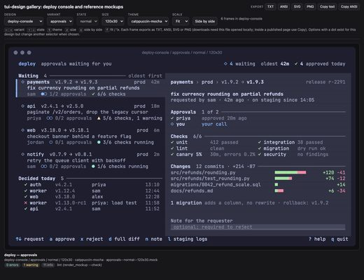

# Awesome Claude Design Skills

[English](README.md)

给 **Claude Code、Codex 等编程 agent 用的开源设计 skill 和工具**:UI 与前端美化、设计系统、Figma 与设计工具 MCP、设计稿转代码、海报与品牌图。共 178 个仓库,每个都由 [Agent Skills Hub](https://agentskillshub.top?utm_source=github&utm_medium=awesome-list) 读过 README 并做了安全评级。

带类型筛选的在线页面:**[https://agentskillshub.top/best/ai-design/](https://agentskillshub.top/best/ai-design/?utm_source=github&utm_medium=awesome-list)** · 每 8 小时刷新

## 这些 skill 能做出什么

<table>
<tr>
<td align="center" valign="top" width="33%"><b>🎨 UI 与前端美化</b> 92 个仓库   让 agent 生成的界面更有设计感的规则和风格。 <a href="#type-ui"><b>查看列表 →</b></a></td>
<td align="center" valign="top" width="33%"><b>📐 设计系统</b> 43 个仓库  agent 遵循的设计令牌、主题和组件规范。 <a href="#type-system"><b>查看列表 →</b></a></td>
<td align="center" valign="top" width="33%"><b>🔌 Figma 与设计工具</b> 18 个仓库  让 agent 操作 Figma、Penpot、Canva 等设计工具。 <a href="#type-tool_mcp"><b>查看列表 →</b></a></td>
</tr>
<tr>
<td align="center" valign="top" width="33%"><b>🧱 设计稿转代码</b> 10 个仓库   把设计稿、截图、线框图转成前端代码。 <a href="#type-to_code"><b>查看列表 →</b></a></td>
<td align="center" valign="top" width="33%"><b>🖼 海报与品牌</b> 12 个仓库  海报、社交配图、Logo 和品牌素材。 <a href="#type-graphics"><b>查看列表 →</b></a></td>
<td align="center" valign="top" width="33%"><b>🔍 设计审查</b> 3 个仓库  设计审查:无障碍、一致性、AI 味。 <a href="#type-review"><b>查看列表 →</b></a></td>
</tr>
</table>

## 目录

- [🎨 UI 与前端美化](#type-ui) (92)
- [📐 设计系统](#type-system) (43)
- [🔌 Figma 与设计工具](#type-tool_mcp) (18)
- [🧱 设计稿转代码](#type-to_code) (10)
- [🖼 海报与品牌](#type-graphics) (12)
- [🔍 设计审查](#type-review) (3)

## 什么样的仓库能上榜

1. 它帮 agent 做视觉设计:UI 与前端风格、设计系统、图形。没有 AI 的组件库、通用图片生成器不算。
2. 它是能安装或运行的软件,不是链接合集或空仓库。
3. 它有 README。没有 README 就没法评级。
4. 50 星及以上只看是否切题;50 星以下还要过 README 质量线(展示效果、一条命令上手、说清产出、文档完整),并且至少 5 星。

这些问题由决策模型逐个读 README 回答,不是人工挑选。卡在线上的仓库可能判到任一边,归错了请提 issue。

## 🎨 UI 与前端美化

[在在线页面打开这一类,按星数排序 →](https://agentskillshub.top/best/ai-design/?utm_source=github&utm_medium=awesome-list#type-ui)

<table><tr>
<td align="center" valign="top"> <a href="https://github.com/oil-oil/oil-ui">oil-oil/oil-ui</a></td>
<td align="center" valign="top"> <a href="https://github.com/kimsh-1/deck-factory">kimsh-1/deck-factory</a></td>
<td align="center" valign="top"> <a href="https://github.com/sva-admin/sv-academy-prom-design">sva-admin/sv-academy-prom-design</a></td>
</tr></table>

| 仓库 | 星数 | 做什么 | 安全评级 |
|---|---:|---|---|
| [nextlevelbuilder/ui-ux-pro-max-skill](https://github.com/nextlevelbuilder/ui-ux-pro-max-skill) | 134.4k | 提供设计智能、用于跨平台构建专业 UI/UX 的 AI skill | [SAFE](https://agentskillshub.top/skill/nextlevelbuilder/ui-ux-pro-max-skill/?utm_source=github&utm_medium=awesome-list) |
| [Leonxlnx/taste-skill](https://github.com/Leonxlnx/taste-skill) | 94.3k | Taste-Skill：让 AI 具备审美，避免生成无聊、千篇一律的内容 | [SAFE](https://agentskillshub.top/skill/Leonxlnx/taste-skill/?utm_source=github&utm_medium=awesome-list) |
| [emilkowalski/skills](https://github.com/emilkowalski/skills) | 44.9k | 设计师和工程师技能 | [SAFE](https://agentskillshub.top/skill/emilkowalski/skills/?utm_source=github&utm_medium=awesome-list) |
| [Nutlope/hallmark](https://github.com/Nutlope/hallmark) | 29.9k | 适用于 Claude Code、Cursor 和 Codex 的反 AI 垃圾设计 skill。 | [SAFE](https://agentskillshub.top/skill/Nutlope/hallmark/?utm_source=github&utm_medium=awesome-list) |
| [alchaincyf/huashu-design](https://github.com/alchaincyf/huashu-design) | 24.8k | Huashu Design：Claude Code 的 HTML 原生设计 skill，支持原型、幻灯片、动画、5维评审和 MP4 导出 | [SAFE](https://agentskillshub.top/skill/alchaincyf/huashu-design/?utm_source=github&utm_medium=awesome-list) |
| [MengTo/Skills](https://github.com/MengTo/Skills) | 6.7k | Agent skills for designers and builders using Codex, Claude, Cursor, and other AI coding agents | [SAFE](https://agentskillshub.top/skill/MengTo/Skills/?utm_source=github&utm_medium=awesome-list) |
| [JimLiu/baoyu-design](https://github.com/JimLiu/baoyu-design) | 4.3k | 本地运行 Claude Design 作为 Agent Skill，支持 Cursor、Claude Code 等，生成自包含 HTML 的 UI 模拟稿、原… | [SAFE](https://agentskillshub.top/skill/JimLiu/baoyu-design/?utm_source=github&utm_medium=awesome-list) |
| [nateherkai/scroll-craft](https://github.com/nateherkai/scroll-craft) | 3.0k | 用于构建沉浸式滚动驱动网站的 agent skill，支持 Codex、Claude Code 等编码 agents，也可作为 Claude Code 插件使… | [SAFE](https://agentskillshub.top/skill/nateherkai/scroll-craft/?utm_source=github&utm_medium=awesome-list) |
| [dominikmartn/nothing-design-skill](https://github.com/dominikmartn/nothing-design-skill) | 2.8k | 用于生成遵循 Nothing 设计语言 UI 的 Claude Code skill。单色、排版、工业风。 | [SAFE](https://agentskillshub.top/skill/dominikmartn/nothing-design-skill/?utm_source=github&utm_medium=awesome-list) |
| [Appllama/appllama-skills](https://github.com/Appllama/appllama-skills) | 2.5k | 构建者，而不只是研究者。将高收入应用模式转为原生品质移动界面的 agent skill。 | [SAFE](https://agentskillshub.top/skill/Appllama/appllama-skills/?utm_source=github&utm_medium=awesome-list) |
| [bergside/typeui](https://github.com/bergside/typeui) | 2.0k | Build better UI with AI | [SAFE](https://agentskillshub.top/skill/bergside/typeui/?utm_source=github&utm_medium=awesome-list) |
| [Trystan-SA/claude-design-system-prompt](https://github.com/Trystan-SA/claude-design-system-prompt) | 2.0k | Reverse-engineered system prompt and skill library that turns an LLM into an opinionated, accessibility-aware, AI-slop-resistant design collaborator. | [SAFE](https://agentskillshub.top/skill/Trystan-SA/claude-design-system-prompt/?utm_source=github&utm_medium=awesome-list) |
| [zanwei/design-dna](https://github.com/zanwei/design-dna) | 1.9k | 将参考界面（图片、截图、URL）转为量化的 Design DNA JSON，再用内容生成匹配界面。 | [SAFE](https://agentskillshub.top/skill/zanwei/design-dna/?utm_source=github&utm_medium=awesome-list) |
| [oil-oil/oil-ui](https://github.com/oil-oil/oil-ui) | 1.2k | 探索不同方向，并排比较，再根据真实截图优化 AI UI 设计。 | [SAFE](https://agentskillshub.top/skill/oil-oil/oil-ui/?utm_source=github&utm_medium=awesome-list) |
| [dickwu/apple-design-skill](https://github.com/dickwu/apple-design-skill) | 1.1k | 基于 Apple HIG 的跨平台 UI/UX 设计审查工具，支持 Flutter、Tauri、Electron、React Native，兼容 Claude… | [SAFE](https://agentskillshub.top/skill/dickwu/apple-design-skill/?utm_source=github&utm_medium=awesome-list) |
| [agiwhitelist/auteur](https://github.com/agiwhitelist/auteur) | 1.0k | Claude Code skill 以电影制作方式指导网站，涵盖提交清单、生成资源、构建和每次发布前执行的 anti-slop linter。 | [SAFE](https://agentskillshub.top/skill/agiwhitelist/auteur/?utm_source=github&utm_medium=awesome-list) |
| [bitjaru/styleseed](https://github.com/bitjaru/styleseed) | 974 | Claude Code、Codex 和 Cursor 的开源设计方法引擎，含 23 个 agent skill，支持固定设计判断、多种语法、语义调色板、参考编… | [SAFE](https://agentskillshub.top/skill/bitjaru/styleseed/?utm_source=github&utm_medium=awesome-list) |
| [carmahhawwari/ui-design-brain](https://github.com/carmahhawwari/ui-design-brain) | 893 | Cursor skill 为 AI agent 提供 60+ 界面组件的实践、布局模式和设计系统规范，避免生成通用 UI。 | [SAFE](https://agentskillshub.top/skill/carmahhawwari/ui-design-brain/?utm_source=github&utm_medium=awesome-list) |
| [xiaopu-ai/web-design](https://github.com/xiaopu-ai/web-design) | 784 | 用于设计美观一致网页的 Claude Code skill——先写规范，再写代码。 | [SAFE](https://agentskillshub.top/skill/xiaopu-ai/web-design/?utm_source=github&utm_medium=awesome-list) |
| [ItsssssJack/power-design](https://github.com/ItsssssJack/power-design) | 722 | Claude 幻灯片 skill，包含 20 条品牌 DNA 设计原则。 | [SAFE](https://agentskillshub.top/skill/ItsssssJack/power-design/?utm_source=github&utm_medium=awesome-list) |
| [superdesigndev/superdesign-skill](https://github.com/superdesigndev/superdesign-skill) | 643 | 面向 Claude Code、Cursor 和 coding agent 的设计 skill。将 AI 界面转为可发布前端。安装：npx skills add… | [SAFE](https://agentskillshub.top/skill/superdesigndev/superdesign-skill/?utm_source=github&utm_medium=awesome-list) |
| [julianoczkowski/designer-skills](https://github.com/julianoczkowski/designer-skills) | 579 | 面向使用 AI 编程工具进行原型设计和构建的设计师的 agent skill 集合，编码设计流程，让 AI 遵循结构化路径而非随机输出。 | [SAFE](https://agentskillshub.top/skill/julianoczkowski/designer-skills/?utm_source=github&utm_medium=awesome-list) |
| [joeseesun/qiaomu-design](https://github.com/joeseesun/qiaomu-design) | 578 | Claude Code设计顾问：反通用UI、风格试衣间、58个真实网站设计系统库 | [SAFE](https://agentskillshub.top/skill/joeseesun/qiaomu-design/?utm_source=github&utm_medium=awesome-list) |
| [pulkitxm/claude-directory](https://github.com/pulkitxm/claude-directory) | 577 | Open-source AI interfaces built with Claude (Fable 5) including hero sections, GLSL shaders, design systems, animations, 3D components and and landin… | [SAFE](https://agentskillshub.top/skill/pulkitxm/claude-directory/?utm_source=github&utm_medium=awesome-list) |
| [geekjourneyx/claude-design-card](https://github.com/geekjourneyx/claude-design-card) | 463 | 用于生成 14 种格式设计卡片的 Claude Code skill，涵盖平台封面、社交分享卡和编辑排版，遵循 Anthropic | [SAFE](https://agentskillshub.top/skill/geekjourneyx/claude-design-card/?utm_source=github&utm_medium=awesome-list) |
| [AThevon/genjutsu](https://github.com/AThevon/genjutsu) | 446 | Claude Code、claude.ai、Cowork 的创意编程 skill，涵盖动效、微交互和设计系统；编码前确认交互方案，反对 AI 套路。 | [SAFE](https://agentskillshub.top/skill/AThevon/genjutsu/?utm_source=github&utm_medium=awesome-list) |
| [codeswithroh/tastemaker](https://github.com/codeswithroh/tastemaker) | 445 | Claude Code skill，基于真实参考图和开发者持久化审美档案生成 UI，避免通用 AI 默认风格。 | [SAFE](https://agentskillshub.top/skill/codeswithroh/tastemaker/?utm_source=github&utm_medium=awesome-list) |
| [ceorkm/mobile-app-ui-design](https://github.com/ceorkm/mobile-app-ui-design) | 412 | Claude Code 的专业移动应用 UI/UX 设计 skill | [SAFE](https://agentskillshub.top/skill/ceorkm/mobile-app-ui-design/?utm_source=github&utm_medium=awesome-list) |
| [senlindesign/taste-skill](https://github.com/senlindesign/taste-skill) | 385 | Claude Code skill——逆向拆解任意网站的设计风格：具体设计令牌与明确取舍（解释 WHY，而非只说 WHAT） | [SAFE](https://agentskillshub.top/skill/senlindesign/taste-skill/?utm_source=github&utm_medium=awesome-list) |
| [educlopez/ui-craft](https://github.com/educlopez/ui-craft) | 376 | 面向 AI 编程 agent 的设计工程系统——以精工级质量交付 UI。安装为 agent skill。 | [SAFE](https://agentskillshub.top/skill/educlopez/ui-craft/?utm_source=github&utm_medium=awesome-list) |
| [tenfoldmarc/website-builder-setup](https://github.com/tenfoldmarc/website-builder-setup) | 351 | 用 Claude Code 无需编程构建动画网站：一次安装包含 UI/UX Pro Max、Framer Motion 和 21st.dev。 | [SAFE](https://agentskillshub.top/skill/tenfoldmarc/website-builder-setup/?utm_source=github&utm_medium=awesome-list) |
| [Adityaraj0421/naksha-studio](https://github.com/Adityaraj0421/naksha-studio) | 321 | 适用于 Claude Code、Cursor、Windsurf、Gemini CLI 和 Copilot 的虚拟设计团队，含26种角色、62个命令和设计知识。 | [SAFE](https://agentskillshub.top/skill/Adityaraj0421/naksha-studio/?utm_source=github&utm_medium=awesome-list) |
| [hylarucoder/benchmark-skill-ui-ux-pro-max](https://github.com/hylarucoder/benchmark-skill-ui-ux-pro-max) | 313 | 使用 Claude Code SDK 和 GLM 4.7，通过 ui-ux-pro-max Skill 自动生成100个落地页的基准测试项目 | [SAFE](https://agentskillshub.top/skill/hylarucoder/benchmark-skill-ui-ux-pro-max/?utm_source=github&utm_medium=awesome-list) |
| [referodesign/refero_skill](https://github.com/referodesign/refero_skill) | 300 | 面向 AI agents 的研究优先设计 skill，通过 Refero MCP 获取真实应用界面和流程。 | [SAFE](https://agentskillshub.top/skill/referodesign/refero_skill/?utm_source=github&utm_medium=awesome-list) |
| [originaleric/dig-ui-skill](https://github.com/originaleric/dig-ui-skill) | 232 | Dig 构建的供 agent 使用的 prompt-as-code 设计系统，适用于 Codex、Cursor 和 Claude Code，含目录、布局、区块… | [SAFE](https://agentskillshub.top/skill/originaleric/dig-ui-skill/?utm_source=github&utm_medium=awesome-list) |
| [Nutlope/variate](https://github.com/Nutlope/variate) | 212 | 生成组件四种设计变体的紧凑型设计 skill，适用于 Claude Code、Codex CLI 和 opencode。 | [SAFE](https://agentskillshub.top/skill/Nutlope/variate/?utm_source=github&utm_medium=awesome-list) |
| [Wholiver/swiftui-design-skill](https://github.com/Wholiver/swiftui-design-skill) | 204 | SwiftUI 前端设计 skill：6条规范、设计咨询、品牌资产指南和五维评审，支持 Claude Code、Cursor、Codex、OpenCode 等… | [SAFE](https://agentskillshub.top/skill/Wholiver/swiftui-design-skill/?utm_source=github&utm_medium=awesome-list) |
| [jiji262/claude-design-skill](https://github.com/jiji262/claude-design-skill) | 204 | 可移植的 Claude skill，将 Claude 变成 HTML 产物设计专家，支持演示文稿、落地页、原型、动画和海报。改编自 Claude.ai 内部设… | [SAFE](https://agentskillshub.top/skill/jiji262/claude-design-skill/?utm_source=github&utm_medium=awesome-list) |
| [3x-haust/oh-my-design](https://github.com/3x-haust/oh-my-design) | 198 | 为 Codex、Claude Code 和兼容 Pi 的 agent 设计认知循环：构框、发散、观察、重构 | [SAFE](https://agentskillshub.top/skill/3x-haust/oh-my-design/?utm_source=github&utm_medium=awesome-list) |
| [ganavisk/nextlevelbuilder-ui-ux-pro-max-skill-Public](https://github.com/ganavisk/nextlevelbuilder-ui-ux-pro-max-skill-Public) | 163 | An AI SKILL that provide design intelligence for building professional UI/UX multiple platforms | [SAFE](https://agentskillshub.top/skill/ganavisk/nextlevelbuilder-ui-ux-pro-max-skill-Public/?utm_source=github&utm_medium=awesome-list) |
| [touchine-ojo/OJO-Design-Skills](https://github.com/touchine-ojo/OJO-Design-Skills) | 162 | 适用于 Codex、Claude Code、ZCode 等 AI coding agent 的可复用 UI/UX 设计 skill | [SAFE](https://agentskillshub.top/skill/touchine-ojo/OJO-Design-Skills/?utm_source=github&utm_medium=awesome-list) |
| [yzfly/awesome-design-html](https://github.com/yzfly/awesome-design-html) | 159 | 115个品牌主题HTML设计，作为Claude Code skill（93网页+22个iOS，含20个中国展示）。一行安装，再说：“Linear风页面”“飞书… | [SAFE](https://agentskillshub.top/skill/yzfly/awesome-design-html/?utm_source=github&utm_medium=awesome-list) |
| [axiaoge2/Apple-Hig-Designer](https://github.com/axiaoge2/Apple-Hig-Designer) | 155 | 遵循 Apple Human Interface Guidelines 设计专业界面的 Claude Code skill | [SAFE](https://agentskillshub.top/skill/axiaoge2/Apple-Hig-Designer/?utm_source=github&utm_medium=awesome-list) |
| [zeke/swiss-design-skill](https://github.com/zeke/swiss-design-skill) | 155 | 面向 AI agent 的瑞士国际主义风格设计系统 skill | [SAFE](https://agentskillshub.top/skill/zeke/swiss-design-skill/?utm_source=github&utm_medium=awesome-list) |
| [robonuggets/design-system](https://github.com/robonuggets/design-system) | 141 | 提供品牌参考，生成完整设计系统页面和一页 A4 品牌手册 PDF。 | [SAFE](https://agentskillshub.top/skill/robonuggets/design-system/?utm_source=github&utm_medium=awesome-list) |
| [Ilm-Alan/frontend-design](https://github.com/Ilm-Alan/frontend-design) | 133 | 适用于 Claude Code、Codex 和 Gemini CLI 的前端设计 skill。八种美学锚点，分别对应特定 CSS token。每次需求选一种。 | [SAFE](https://agentskillshub.top/skill/Ilm-Alan/frontend-design/?utm_source=github&utm_medium=awesome-list) |
| [TheGoat395/Codex-Skills](https://github.com/TheGoat395/Codex-Skills) | 126 | Codex 优先的 Agent Skills 库，涵盖前端、网站、动效、无障碍、QA 和交付流程。 | [SAFE](https://agentskillshub.top/skill/TheGoat395/Codex-Skills/?utm_source=github&utm_medium=awesome-list) |
| [TidyFactor/Styler](https://github.com/TidyFactor/Styler) | 118 | Production-Stage Visual Design & In-Codebase UI Engineering Suite | [SAFE](https://agentskillshub.top/skill/TidyFactor/Styler/?utm_source=github&utm_medium=awesome-list) |
| [ohmiler/gridgeist](https://github.com/ohmiler/gridgeist) | 115 | Gridgeist 将产品意图转化为严谨的视觉系统，避免千篇一律的 AI SaaS 风格。 | [SAFE](https://agentskillshub.top/skill/ohmiler/gridgeist/?utm_source=github&utm_medium=awesome-list) |
| [HermeticOrmus/LibreUIUX-Claude-Code](https://github.com/HermeticOrmus/LibreUIUX-Claude-Code) | 112 | Claude Code 的 UI/UX 系统：71 个插件、93 个 agent、74 个 skill，涵盖设计、无障碍和前端工作流。 | [SAFE](https://agentskillshub.top/skill/HermeticOrmus/LibreUIUX-Claude-Code/?utm_source=github&utm_medium=awesome-list) |
| [SpaceZephyr/brand-design-md](https://github.com/SpaceZephyr/brand-design-md) | 109 | 为 AI agent 按需提供62个品牌设计语言的 Claude Code skill | [SAFE](https://agentskillshub.top/skill/SpaceZephyr/brand-design-md/?utm_source=github&utm_medium=awesome-list) |
| [MaxHan7/frontend-ui-standards-skill](https://github.com/MaxHan7/frontend-ui-standards-skill) | 106 | 设计系统优先的前端 UI 实现 Codex skill | [SAFE](https://agentskillshub.top/skill/MaxHan7/frontend-ui-standards-skill/?utm_source=github&utm_medium=awesome-list) |
| [MickeyAlton33/web-designer-plugin](https://github.com/MickeyAlton33/web-designer-plugin) | 105 | 网页设计 skill，适用于 Claude Code。来自 38 个网站的 48 种模式，避免生成通用 AI 前端。 | [SAFE](https://agentskillshub.top/skill/MickeyAlton33/web-designer-plugin/?utm_source=github&utm_medium=awesome-list) |
| [cth9191/taste-vault](https://github.com/cth9191/taste-vault) | 105 | 本地设计风格图库：输入截图，输出设计词汇和可粘贴的 Claude Code 简报。网页设计三步流程第 1 步。 | [SAFE](https://agentskillshub.top/skill/cth9191/taste-vault/?utm_source=github&utm_medium=awesome-list) |
| [yizhiyanhua-ai/fireworks-design](https://github.com/yizhiyanhua-ai/fireworks-design) | 104 | Claude Code 工作流：复现 ClaudeDesign，支持并行设计探索、面板评审、综合与对抗式优化，生成单个前端页面；双语 README | [SAFE](https://agentskillshub.top/skill/yizhiyanhua-ai/fireworks-design/?utm_source=github&utm_medium=awesome-list) |
| [INSANE0777/Awwwards-mcp](https://github.com/INSANE0777/Awwwards-mcp) | 102 | 开源 MCP server，为 Claude Code、Codex、Cursor、OpenCode、ZCode 提供网站参考，支持截图搜索和网站记录，免 AP… | [SAFE](https://agentskillshub.top/skill/INSANE0777/Awwwards-mcp/?utm_source=github&utm_medium=awesome-list) |
| [ihlamury/design-skills](https://github.com/ihlamury/design-skills) | 93 | 从设计系统提取的 UI 约束，用于配合 AI agent 构建像素级界面。 | [SAFE](https://agentskillshub.top/skill/ihlamury/design-skills/?utm_source=github&utm_medium=awesome-list) |
| [PyModel/niblet-skill-mcp](https://github.com/PyModel/niblet-skill-mcp) | 87 | 基于真实产品界面的 MCP server 和 design skill，用于编码 agent 的 UI 工作。两种工具，可通过 npx 安装。 | [SAFE](https://agentskillshub.top/skill/PyModel/niblet-skill-mcp/?utm_source=github&utm_medium=awesome-list) |
| [saifyxpro/ui-ux-design-pro-skill](https://github.com/saifyxpro/ui-ux-design-pro-skill) | 86 | AI配对、150+推理规则、CLI、18个平台模板；支持Claude、Cursor等；107种风格、127套配色、107种字体 | [SAFE](https://agentskillshub.top/skill/saifyxpro/ui-ux-design-pro-skill/?utm_source=github&utm_medium=awesome-list) |
| [mikesheehan54/Claude-Code-Design-AI](https://github.com/mikesheehan54/Claude-Code-Design-AI) | 84 | Claude Design：AI UI/UX工具，支持截图转 React、Figma、Tailwind CSS、设计系统、SVG、暗色模式、响应式布局和代码导… | [SAFE](https://agentskillshub.top/skill/mikesheehan54/Claude-Code-Design-AI/?utm_source=github&utm_medium=awesome-list) |
| [kimsh-1/deck-factory](https://github.com/kimsh-1/deck-factory) | 79 | 一行意图 → 一份演示级深色编辑风 HTML 演示文稿。Claude Code skill。 | [SAFE](https://agentskillshub.top/skill/kimsh-1/deck-factory/?utm_source=github&utm_medium=awesome-list) |
| [awesome-skills/mobile-app-design](https://github.com/awesome-skills/mobile-app-design) | 78 | Claude Code 移动应用 UI/UX 设计 skill：iOS、Android、无障碍和 React Native 最佳实践 | [SAFE](https://agentskillshub.top/skill/awesome-skills/mobile-app-design/?utm_source=github&utm_medium=awesome-list) |
| [Laith0003/ux-skill](https://github.com/Laith0003/ux-skill) | 77 | Claude Code、Cursor、Windsurf 设计引擎：确定性反 AI-slop 检查器（152 条规则）；离线运行，不调用 LLM，MIT。 | [SAFE](https://agentskillshub.top/skill/Laith0003/ux-skill/?utm_source=github&utm_medium=awesome-list) |
| [Songzhi-lab/chinese-font-selector](https://github.com/Songzhi-lab/chinese-font-selector) | 75 | 中文字体选择 agent skill：可商用 CJK 字体库、场景选字矩阵、CJK-Latin 搭配规则，支持 Claude Code、Cursor、Kimi… | [SAFE](https://agentskillshub.top/skill/Songzhi-lab/chinese-font-selector/?utm_source=github&utm_medium=awesome-list) |
| [szilu/ux-designer-skill](https://github.com/szilu/ux-designer-skill) | 75 | 基于现代最佳实践（2026）的 UX/UI 设计指导 Claude Code skill | [SAFE](https://agentskillshub.top/skill/szilu/ux-designer-skill/?utm_source=github&utm_medium=awesome-list) |
| [h3nryprod01/design-taste](https://github.com/h3nryprod01/design-taste) | 70 | Claude Code / Cowork 的前端设计规范，涵盖字体、配色、动效、组件与反套路。 | [SAFE](https://agentskillshub.top/skill/h3nryprod01/design-taste/?utm_source=github&utm_medium=awesome-list) |
| [dembrandt/dembrandt-skills](https://github.com/dembrandt/dembrandt-skills) | 69 | 高级 UX 与设计系统知识，让 AI agent 自动应用。 | [SAFE](https://agentskillshub.top/skill/dembrandt/dembrandt-skills/?utm_source=github&utm_medium=awesome-list) |
| [AgriciDaniel/gogh](https://github.com/AgriciDaniel/gogh) | 64 | Gogh 是带来源引用的 Obsidian 工作中枢，将六种前端设计 skill 整合为一套供 AI coding agents 使用的技术栈。 | [SAFE](https://agentskillshub.top/skill/AgriciDaniel/gogh/?utm_source=github&utm_medium=awesome-list) |
| [haider-nawaz/liquid-glass-skill](https://github.com/haider-nawaz/liquid-glass-skill) | 64 | 用于使用 SwiftUI Liquid Glass 设计系统构建和迁移 Apple 平台应用的 Claude Code skill（iOS 26+、macOS… | [SAFE](https://agentskillshub.top/skill/haider-nawaz/liquid-glass-skill/?utm_source=github&utm_medium=awesome-list) |
| [CaesiumY/ko-design-md](https://github.com/CaesiumY/ko-design-md) | 62 | 한국 브랜드의 디자인 언어를 출처가 달린 DESIGN.md 한 장으로 정리한 오픈 카탈로그 — Open catalog of Korean brands' design languages, one cited DESIGN.md per brand. | [SAFE](https://agentskillshub.top/skill/CaesiumY/ko-design-md/?utm_source=github&utm_medium=awesome-list) |
| [Ilbie/Toss-Design-Skill](https://github.com/Ilbie/Toss-Design-Skill) | 56 | 参考 Toss Tech Design 文章制作的非官方 skill。 | [SAFE](https://agentskillshub.top/skill/Ilbie/Toss-Design-Skill/?utm_source=github&utm_medium=awesome-list) |
| [phazurlabs/sumi](https://github.com/phazurlabs/sumi) | 54 | Sumi——Claude Code 的 UX/UI 设计知识库：43 个 skill、168 份参考、37 个命令，反低质设计并提供可审计引用链。使用 /su… | [SAFE](https://agentskillshub.top/skill/phazurlabs/sumi/?utm_source=github&utm_medium=awesome-list) |
| [frhscopex/design-skill-os](https://github.com/frhscopex/design-skill-os) | 51 | 面向 AI agent 的设计知识层，综合 10 多本设计书籍，生成明确意图的 UI/UX，避免套路。 | [SAFE](https://agentskillshub.top/skill/frhscopex/design-skill-os/?utm_source=github&utm_medium=awesome-list) |
| [QingYunA/agent-html](https://github.com/QingYunA/agent-html) | 50 | 零依赖、单文件 HTML 设计系统与 agent skill，受 shadcn/ui 启发。完全离线、无需 npm，提供 6 种布局原型和 LLM 原子工具集。 | [SAFE](https://agentskillshub.top/skill/QingYunA/agent-html/?utm_source=github&utm_medium=awesome-list) |
| [stevembarclay/pencilplaybook](https://github.com/stevembarclay/pencilplaybook) | 49 | PencilPlaybook 是 Pencil.dev + Claude Code 的 UI Taste-Skill，结合感知心理学与资深设计约束，减少雷同… | [SAFE](https://agentskillshub.top/skill/stevembarclay/pencilplaybook/?utm_source=github&utm_medium=awesome-list) |
| [iamzifei/james-design](https://github.com/iamzifei/james-design) | 39 | 面向 Claude Code 的 UI 设计 skill：创建高保真 HTML 设计、原型、幻灯片和动画 | [SAFE](https://agentskillshub.top/skill/iamzifei/james-design/?utm_source=github&utm_medium=awesome-list) |
| [nghiahsgs/skills-slides](https://github.com/nghiahsgs/skills-slides) | 33 | 5万多个独特 HTML 演示设计。零依赖。拒绝 AI 垃圾风。Claude Code skill。 | [SAFE](https://agentskillshub.top/skill/nghiahsgs/skills-slides/?utm_source=github&utm_medium=awesome-list) |
| [sva-admin/sv-academy-prom-design](https://github.com/sva-admin/sv-academy-prom-design) | 29 | Claude Code、Cowork 和 Cursor 的设计风格。Prom 是泰语“准备好”的意思。免费学习：loop.sv-academy.org | [SAFE](https://agentskillshub.top/skill/sva-admin/sv-academy-prom-design/?utm_source=github&utm_medium=awesome-list) |
| [regutierrez/ui-ux-skill](https://github.com/regutierrez/ui-ux-skill) | 26 | UI-UX skill，基于 ui-ux-pro-max-skill 分支，用 Python 重写 | [CAUTION](https://agentskillshub.top/skill/regutierrez/ui-ux-skill/?utm_source=github&utm_medium=awesome-list) |
| [diegomarino/tui-design](https://github.com/diegomarino/tui-design) | 17 | 用于设计、模拟、构建和审计终端 UI 的 agent skill | [SAFE](https://agentskillshub.top/skill/diegomarino/tui-design/?utm_source=github&utm_medium=awesome-list) |
| [Shawnchee/frontend-god-mode](https://github.com/Shawnchee/frontend-god-mode) | 15 | 将前端设计 skill 集成到一个 skill 中 | [SAFE](https://agentskillshub.top/skill/Shawnchee/frontend-god-mode/?utm_source=github&utm_medium=awesome-list) |
| [LaoFeng-mouse/fantasy-mouse-ui](https://github.com/LaoFeng-mouse/fantasy-mouse-ui) | 11 | 适用于 Codex、Claude、Gemini、DeepSeek 和通用 Agents 的模型无关 Fantasy Mouse UI 设计插件 | [SAFE](https://agentskillshub.top/skill/LaoFeng-mouse/fantasy-mouse-ui/?utm_source=github&utm_medium=awesome-list) |
| [Nyx-abu/awwwards-ui-skill](https://github.com/Nyx-abu/awwwards-ui-skill) | 11 | 提升 AI 生成 UI 设计质量的 skill，教 Claude Code、Codex、Antigravity 构建涵盖动效、排版、色彩和 WCAG AA 的… | [SAFE](https://agentskillshub.top/skill/Nyx-abu/awwwards-ui-skill/?utm_source=github&utm_medium=awesome-list) |
| [ajantoniou/fable-design-system](https://github.com/ajantoniou/fable-design-system) | 10 | Fable 风格设计系统，适用于 AI coding agent、Claude、Opus 4.8、Codex、Cursor、Gemini、Antigravit… | [CAUTION](https://agentskillshub.top/skill/ajantoniou/fable-design-system/?utm_source=github&utm_medium=awesome-list) |
| [linkonai2026-kr/design-on](https://github.com/linkonai2026-kr/design-on) | 10 | 一句话出网页；4制3审，检59种反模式；Impeccable、tasteskill、UI Skills、emil-skill；Claude Code/Code… | [SAFE](https://agentskillshub.top/skill/linkonai2026-kr/design-on/?utm_source=github&utm_medium=awesome-list) |
| [sshahzaiib/senior-designer-skill](https://github.com/sshahzaiib/senior-designer-skill) | 10 | Claude Code 高级产品设计 skill：基于158份审核资料，构建研究驱动、无障碍且不千篇一律的UI，附质量评分清单。 | [SAFE](https://agentskillshub.top/skill/sshahzaiib/senior-designer-skill/?utm_source=github&utm_medium=awesome-list) |
| [narenkatakam/ux-audit](https://github.com/narenkatakam/ux-audit) | 9 | 为 AI 编程助手提供设计指导：12 项原则、13 份参考文档、7 份组件检查清单。支持 Claude Code、Cursor、Codex 和 Windsur… | [SAFE](https://agentskillshub.top/skill/narenkatakam/ux-audit/?utm_source=github&utm_medium=awesome-list) |
| [alwkala/Cinematic-Landing-Kit](https://github.com/alwkala/Cinematic-Landing-Kit) | 8 | 基于 context-and-memory package 的记忆驱动设计系统，指导任意 AI coding agent 生成滚动驱动的产品落地页。单个 HT… | [SAFE](https://agentskillshub.top/skill/alwkala/Cinematic-Landing-Kit/?utm_source=github&utm_medium=awesome-list) |
| [SuanFishXYY/suanfish-design-system](https://github.com/SuanFishXYY/suanfish-design-system) | 7 | Suanfish Design System：7层33个AI设计agent，含REJECT机制；v2.5新增Path G（流式、工具调用、推理、引用、工件）。 | [SAFE](https://agentskillshub.top/skill/SuanFishXYY/suanfish-design-system/?utm_source=github&utm_medium=awesome-list) |
| [joepUI/motion-ref-skill](https://github.com/joepUI/motion-ref-skill) | 6 | UI 动效设计 skill，含13类111种效果；按场景生成CSS/JS代码，支持 Claude Code、Codex、OpenClaw。 | [SAFE](https://agentskillshub.top/skill/joepUI/motion-ref-skill/?utm_source=github&utm_medium=awesome-list) |
| [nabinkhair42/structural-grid-skill](https://github.com/nabinkhair42/structural-grid-skill) | 6 | 面向 AI coding agent 的 Structural Grid（Exposed Grid / Rail Layout）设计系统 skill。 | [SAFE](https://agentskillshub.top/skill/nabinkhair42/structural-grid-skill/?utm_source=github&utm_medium=awesome-list) |
| [undsky/doudou-color-skill](https://github.com/undsky/doudou-color-skill) | 5 | 结合五行色彩哲学与现代色彩和弦，提供数字产品、品牌印刷和海报配色方案 | [SAFE](https://agentskillshub.top/skill/undsky/doudou-color-skill/?utm_source=github&utm_medium=awesome-list) |

## 📐 设计系统

[在在线页面打开这一类,按星数排序 →](https://agentskillshub.top/best/ai-design/?utm_source=github&utm_medium=awesome-list#type-system)

| 仓库 | 星数 | 做什么 | 安全评级 |
|---|---:|---|---|
| [nexu-io/open-design](https://github.com/nexu-io/open-design) | 100.3k | Claude Code、Codex、Cursor、DeepSeek Harness、OpenCode 的本地设计应用，支持生成与导出 HTML/PDF/PPT… | [SAFE](https://agentskillshub.top/skill/nexu-io/open-design/?utm_source=github&utm_medium=awesome-list) |
| [Manavarya09/design-extract](https://github.com/Manavarya09/design-extract) | 4.2k | 一条命令提取网站设计系统：DTCG tokens、MCP server、多平台输出、Tailwind v4、Figma variables、shadcn/ui… | [SAFE](https://agentskillshub.top/skill/Manavarya09/design-extract/?utm_source=github&utm_medium=awesome-list) |
| [bergside/design-md-chrome](https://github.com/bergside/design-md-chrome) | 3.0k | 基于 TypeUI 的 Chrome 扩展，可提取网站样式并为 AI 生成 DESIGN.md 文件和设计 skill | [SAFE](https://agentskillshub.top/skill/bergside/design-md-chrome/?utm_source=github&utm_medium=awesome-list) |
| [plugin87/ux-ui-agent-skills](https://github.com/plugin87/ux-ui-agent-skills) | 1.6k | Turn Claude into a senior design architect: DTCG tokens, 52 components, WCAG 2.2 AA-AAA, 138 design systems, any-framework code, and 50 objective gat… | [SAFE](https://agentskillshub.top/skill/plugin87/ux-ui-agent-skills/?utm_source=github&utm_medium=awesome-list) |
| [dominikmartn/hue](https://github.com/dominikmartn/hue) | 838 | 开源 skill，可学习任意品牌并生成完整设计系统。支持 Claude Code 和 Codex。助手构建的 UI 均符合品牌。 | [SAFE](https://agentskillshub.top/skill/dominikmartn/hue/?utm_source=github&utm_medium=awesome-list) |
| [Railly/tinte](https://github.com/Railly/tinte) | 624 | 将设计系统编译为 Agent Plugin，提取视觉身份，生成 SKILL.md 与 tokens.css，检查绕过 tokens 的内容。 | [SAFE](https://agentskillshub.top/skill/Railly/tinte/?utm_source=github&utm_medium=awesome-list) |
| [AnxForever/stylekit](https://github.com/AnxForever/stylekit) | 596 | 开源 AI 生成 UI 视觉风格库：148 套风格，包含 design tokens、prompts、MCP、Agent Skill 和 npm CLI。 | [SAFE](https://agentskillshub.top/skill/AnxForever/stylekit/?utm_source=github&utm_medium=awesome-list) |
| [kwakseongjae/oh-my-design](https://github.com/kwakseongjae/oh-my-design) | 533 | 为 AI coding agent 提供设计系统：一条命令将公司 DESIGN.md 参考和 skill 安装到 Claude Code、Codex、Curs… | [SAFE](https://agentskillshub.top/skill/kwakseongjae/oh-my-design/?utm_source=github&utm_medium=awesome-list) |
| [oalanicolas/claude-design-premium](https://github.com/oalanicolas/claude-design-premium) | 273 | Claude Design 设计系统入门套件 | [SAFE](https://agentskillshub.top/skill/oalanicolas/claude-design-premium/?utm_source=github&utm_medium=awesome-list) |
| [marvkr/better-design](https://github.com/marvkr/better-design) | 255 | 开源 MCP server 与 shadcn/ui registry：含31个主题、设计令牌、UI原则和WCAG规则，支持 Claude Code、Curso… | [SAFE](https://agentskillshub.top/skill/marvkr/better-design/?utm_source=github&utm_medium=awesome-list) |
| [redongreen/uSpec](https://github.com/redongreen/uSpec) | 245 | 由 AI agent 直接生成 UI 组件设计系统文档，可渲染到 Figma 或 .md 文件，支持 Cursor、Claude Code 和 Codex。 | [SAFE](https://agentskillshub.top/skill/redongreen/uSpec/?utm_source=github&utm_medium=awesome-list) |
| [arvindrk/extract-design-system](https://github.com/arvindrk/extract-design-system) | 238 | 从公开网站提取设计令牌（颜色、字体、间距、圆角、阴影），生成 JSON 和 CSS 自定义属性，可作为 Claude、Cursor、Codex 的 agent… | [SAFE](https://agentskillshub.top/skill/arvindrk/extract-design-system/?utm_source=github&utm_medium=awesome-list) |
| [southleft/story-ui](https://github.com/southleft/story-ui) | 234 | AI 驱动的 Storybook story 生成器，支持任意框架、设计系统和 LLM 提供商 | [SAFE](https://agentskillshub.top/skill/southleft/story-ui/?utm_source=github&utm_medium=awesome-list) |
| [guiguiyan930-source/game-ui-design-workflow](https://github.com/guiguiyan930-source/game-ui-design-workflow) | 225 | 面向游戏 UI 设计的 Cursor Agent Skills 工作流，涵盖原型生成、风格切换、页面延展和组件拆解，通过 Spec-Kit 文档、视觉契约与资… | [SAFE](https://agentskillshub.top/skill/guiguiyan930-source/game-ui-design-workflow/?utm_source=github&utm_medium=awesome-list) |
| [uxKero/anydesign](https://github.com/uxKero/anydesign) | 216 | 分析图像、网站和 Figma 文件，生成包含令牌系统、组件清单和重建说明的结构化 design.md 的 Claude skill | [SAFE](https://agentskillshub.top/skill/uxKero/anydesign/?utm_source=github&utm_medium=awesome-list) |
| [senlindesign/claude2figma](https://github.com/senlindesign/claude2figma) | 205 | Claude Code + Figma 的约束层：4 个 skill 让 AI 遵循你的 Design System。组件保持关联，tokens 保持绑定，不… | [SAFE](https://agentskillshub.top/skill/senlindesign/claude2figma/?utm_source=github&utm_medium=awesome-list) |
| [tsubotax/melta-ui](https://github.com/tsubotax/melta-ui) | 201 | 人类和 AI 都能读懂的设计系统，适用于 Claude Code 和 Cursor | [SAFE](https://agentskillshub.top/skill/tsubotax/melta-ui/?utm_source=github&utm_medium=awesome-list) |
| [jamesrochabrun/Easel](https://github.com/jamesrochabrun/Easel) | 168 | Easel 是 Codex 和 Claude 的 macOS 工作区，支持 AI 产品设计与前端迭代，集成本地项目库、设计系统、Codex 对话、网页预览检查… | [SAFE](https://agentskillshub.top/skill/jamesrochabrun/Easel/?utm_source=github&utm_medium=awesome-list) |
| [bergside/design-md-figma](https://github.com/bergside/design-md-figma) | 153 | Figma 插件，提取本地样式规范并生成 DESIGN.md 和 SKILL.md，供 Claude Code、Codex、Cursor 等 AI 工具使用 | [SAFE](https://agentskillshub.top/skill/bergside/design-md-figma/?utm_source=github&utm_medium=awesome-list) |
| [skydashnet/material-design-3-ui-skill](https://github.com/skydashnet/material-design-3-ui-skill) | 139 | 用于使用 Google Material Design 3、Material You、M3 Expressive、无障碍、适配布局和语义化设计令牌设计、评审与… | [SAFE](https://agentskillshub.top/skill/skydashnet/material-design-3-ui-skill/?utm_source=github&utm_medium=awesome-list) |
| [OpenLabs-so/oa-design](https://github.com/OpenLabs-so/oa-design) | 134 | Open Analytics 设计语言作为 agent skill：组件配方、类型检查源码、token CSS 和 CLI，适用于 Claude Code、C… | [SAFE](https://agentskillshub.top/skill/OpenLabs-so/oa-design/?utm_source=github&utm_medium=awesome-list) |
| [luongnv89/sleek-ui](https://github.com/luongnv89/sleek-ui) | 134 | The Unsplash of design systems for AI agents — re-skin your app with one URL | [SAFE](https://agentskillshub.top/skill/luongnv89/sleek-ui/?utm_source=github&utm_medium=awesome-list) |
| [bluzir/claude-code-design](https://github.com/bluzir/claude-code-design) | 106 | 为 Claude Code 复现 Claude Design：用 skills、starters 和 Chrome DevTools MCP 创建 HTML… | [SAFE](https://agentskillshub.top/skill/bluzir/claude-code-design/?utm_source=github&utm_medium=awesome-list) |
| [southleft/figma-console-mcp-skills](https://github.com/southleft/figma-console-mcp-skills) | 90 | Figma Console MCP：Figma MCP server的Markdown skill，含令牌、变量、组件、WCAG审计、版本、FigJam、Sl… | [SAFE](https://agentskillshub.top/skill/southleft/figma-console-mcp-skills/?utm_source=github&utm_medium=awesome-list) |
| [educlopez/design-bites](https://github.com/educlopez/design-bites) | 84 | 精选网站的 DESIGN.md 文件，解析设计系统，供 AI agents 使用。Sparkbites 出品。 | [SAFE](https://agentskillshub.top/skill/educlopez/design-bites/?utm_source=github&utm_medium=awesome-list) |
| [Devesh-Shirsath/spotkit](https://github.com/Devesh-Shirsath/spotkit) | 81 | Spotkit：Claude Code skill，将功能描述转为统一设计系统中的极简抽象 SVG 产品插图。 | [SAFE](https://agentskillshub.top/skill/Devesh-Shirsath/spotkit/?utm_source=github&utm_medium=awesome-list) |
| [birdseyevue/daisyui-mcp](https://github.com/birdseyevue/daisyui-mcp) | 78 | 基于公开 llms.txt 的 DaisyUI 组件文档本地 MCP 服务器 | [SAFE](https://agentskillshub.top/skill/birdseyevue/daisyui-mcp/?utm_source=github&utm_medium=awesome-list) |
| [jrpease/throughline](https://github.com/jrpease/throughline) | 78 | Throughline——连接设计与代码。Claude Code 插件，引导你从空白 Figma 文件构建同步、经过故事测试的组件库。 | [SAFE](https://agentskillshub.top/skill/jrpease/throughline/?utm_source=github&utm_medium=awesome-list) |
| [qiuyiwu1989-star/opendesign](https://github.com/qiuyiwu1989-star/opendesign) | 73 | 1,486 个真实网页设计系统，提取为机器可读规范。面向 AI coding agents 的 MCP server。 | [SAFE](https://agentskillshub.top/skill/qiuyiwu1989-star/opendesign/?utm_source=github&utm_medium=awesome-list) |
| [adityarajdigital/designmd](https://github.com/adityarajdigital/designmd) | 70 | 为 AI coding 工作流提取设计上下文。从任意 URL 提取颜色、字体、间距和断点，生成可移植的 DESIGN.md。 | [SAFE](https://agentskillshub.top/skill/adityarajdigital/designmd/?utm_source=github&utm_medium=awesome-list) |
| [yuvrajangadsingh/brandmd](https://github.com/yuvrajangadsingh/brandmd) | 68 | 防止 Claude Code/Cursor 猜测 UI。将任意网站设计系统提取为符合规范的 DESIGN.md，通过官方 @google/design.md… | [SAFE](https://agentskillshub.top/skill/yuvrajangadsingh/brandmd/?utm_source=github&utm_medium=awesome-list) |
| [hakilee/design-farmer](https://github.com/hakilee/design-farmer) | 61 | 将设计系统质量从“尽力而为”变成可重复的工程流程的 agent skill。 | [SAFE](https://agentskillshub.top/skill/hakilee/design-farmer/?utm_source=github&utm_medium=awesome-list) |
| [MohtashamMurshid/getdesign](https://github.com/MohtashamMurshid/getdesign) | 56 | 任意 URL 按需生成设计系统。五种形式，一个 agent：web、API、CLI、TypeScript SDK，以及可在 Claude Code、Codex… | [SAFE](https://agentskillshub.top/skill/MohtashamMurshid/getdesign/?utm_source=github&utm_medium=awesome-list) |
| [hasi98/designpull](https://github.com/hasi98/designpull) | 56 | 用 AI 视觉从任意网站生成兼容 Google Stitch 的 DESIGN.md 文件。使用自有 Gemini、OpenAI、Claude 或 Ollam… | [SAFE](https://agentskillshub.top/skill/hasi98/designpull/?utm_source=github&utm_medium=awesome-list) |
| [jubscodes/get-shit-pretty](https://github.com/jubscodes/get-shit-pretty) | 55 | 为 AI 编程工具做设计工程。品牌识别与设计项目，从策略到代码。 | [SAFE](https://agentskillshub.top/skill/jubscodes/get-shit-pretty/?utm_source=github&utm_medium=awesome-list) |
| [jiemianduan/poster-style-transfer](https://github.com/jiemianduan/poster-style-transfer) | 54 | 用于提取海报设计系统并将其迁移到原创海报概念的开放 Agent Skill。 | [SAFE](https://agentskillshub.top/skill/jiemianduan/poster-style-transfer/?utm_source=github&utm_medium=awesome-list) |
| [natdexterra/work-with-design-systems](https://github.com/natdexterra/work-with-design-systems) | 52 | 从 Claude Code 检查、构建或扩展 Figma 设计系统；支持只读审计、WCAG 检查、组件评分，构建模式含变量绑定和 slots，可选 Phase… | [SAFE](https://agentskillshub.top/skill/natdexterra/work-with-design-systems/?utm_source=github&utm_medium=awesome-list) |
| [ake77-code/distill-design](https://github.com/ake77-code/distill-design) | 27 | 将任意网站提炼为 DESIGN.md——AI 可直接读取、用于生成符合品牌 UI 的纯文本设计规范。 | [SAFE](https://agentskillshub.top/skill/ake77-code/distill-design/?utm_source=github&utm_medium=awesome-list) |
| [mmohajer9/video-to-ui](https://github.com/mmohajer9/video-to-ui) | 13 | 将 UI 屏幕录制转为设计数据、代码修改或可运行的 React 脚手架。Claude Code skill。 | [SAFE](https://agentskillshub.top/skill/mmohajer9/video-to-ui/?utm_source=github&utm_medium=awesome-list) |
| [imsaif/design-with-claude](https://github.com/imsaif/design-with-claude) | 11 | dwic 是终端内的产品设计工具。运行 npx dwic-audit 检查 WCAG 对比度、令牌偏移和结构缺口，由48名设计专家修复，并跨会话记住设计决策。 | [SAFE](https://agentskillshub.top/skill/imsaif/design-with-claude/?utm_source=github&utm_medium=awesome-list) |
| [juanlara-aidev/macos-26-design](https://github.com/juanlara-aidev/macos-26-design) | 7 | macOS 26（Liquid Glass）可作为 Claude Code、Cursor 和 Gemini CLI 的即插即用 skill。 | [SAFE](https://agentskillshub.top/skill/juanlara-aidev/macos-26-design/?utm_source=github&utm_medium=awesome-list) |
| [kalilfagundes/design-system-extractor-skill](https://github.com/kalilfagundes/design-system-extractor-skill) | 7 | Claude/Antigravity/Opencode AI skill，可从任意网站逆向分析设计系统，提取颜色、字体、间距和组件，生成交互式 HTML 文档。 | [SAFE](https://agentskillshub.top/skill/kalilfagundes/design-system-extractor-skill/?utm_source=github&utm_medium=awesome-list) |
| [kenneives/design-token-bridge-mcp](https://github.com/kenneives/design-token-bridge-mcp) | 5 | 在 Tailwind、Figma、CSS 与 Material 3、SwiftUI、CSS Variables 之间转换设计令牌的 MCP server，用于… | [SAFE](https://agentskillshub.top/skill/kenneives/design-token-bridge-mcp/?utm_source=github&utm_medium=awesome-list) |

## 🔌 Figma 与设计工具

[在在线页面打开这一类,按星数排序 →](https://agentskillshub.top/best/ai-design/?utm_source=github&utm_medium=awesome-list#type-tool_mcp)

| 仓库 | 星数 | 做什么 | 安全评级 |
|---|---:|---|---|
| [GLips/Figma-Context-MCP](https://github.com/GLips/Figma-Context-MCP) | 16.0k | 为 Cursor 等 AI 编程 agent 提供 Figma 布局信息的 MCP server | [SAFE](https://agentskillshub.top/skill/GLips/Figma-Context-MCP/?utm_source=github&utm_medium=awesome-list) |
| [southleft/figma-console-mcp](https://github.com/southleft/figma-console-mcp) | 2.5k | 将你的设计系统作为 API。连接 AI 与 Figma，用于提取、创建和调试。 | [SAFE](https://agentskillshub.top/skill/southleft/figma-console-mcp/?utm_source=github&utm_medium=awesome-list) |
| [arinspunk/claude-talk-to-figma-mcp](https://github.com/arinspunk/claude-talk-to-figma-mcp) | 668 | 支持 Claude Desktop、Claude Code、Cursor、Antigravity 等 AI 工具读取、分析和修改 Figma 设计的 Mode… | [SAFE](https://agentskillshub.top/skill/arinspunk/claude-talk-to-figma-mcp/?utm_source=github&utm_medium=awesome-list) |
| [penpot/penpot-mcp](https://github.com/penpot/penpot-mcp) | 526 | Penpot 官方 MCP 服务器 | [SAFE](https://agentskillshub.top/skill/penpot/penpot-mcp/?utm_source=github&utm_medium=awesome-list) |
| [moguzbulbul/blueprint-animation](https://github.com/moguzbulbul/blueprint-animation) | 414 | Claude Design skill：用蓝图绘图逐步讲解动画化的 UX 重设计，作者 @moguzbulbul | [SAFE](https://agentskillshub.top/skill/moguzbulbul/blueprint-animation/?utm_source=github&utm_medium=awesome-list) |
| [TranHoaiHung/figma-ui-mcp](https://github.com/TranHoaiHung/figma-ui-mcp) | 262 | AI 可通过 JavaScript 在 Figma 画布绘制 UI，并将现有设计读取为结构化数据。支持 Claude Code、Cursor、VS Code… | [SAFE](https://agentskillshub.top/skill/TranHoaiHung/figma-ui-mcp/?utm_source=github&utm_medium=awesome-list) |
| [noemuch/bridge](https://github.com/noemuch/bridge) | 156 | 使用 Claude Code 在 Figma 中设计。Bridge 通过 WebSocket 将终端连接到 Figma Plugin API。 | [SAFE](https://agentskillshub.top/skill/noemuch/bridge/?utm_source=github&utm_medium=awesome-list) |
| [alima-max/prototype-to-figma-skill](https://github.com/alima-max/prototype-to-figma-skill) | 141 | Claude skill：分析Claude Code原型，用搜索和Code Connect映射至Figma设计系统，逐状态生成画面并标注触发器、转换和边界情况 | [SAFE](https://agentskillshub.top/skill/alima-max/prototype-to-figma-skill/?utm_source=github&utm_medium=awesome-list) |
| [youware-labs/figma-pilot](https://github.com/youware-labs/figma-pilot) | 106 | 通过代码执行让 AI agent 控制 Figma 的 MCP | [SAFE](https://agentskillshub.top/skill/youware-labs/figma-pilot/?utm_source=github&utm_medium=awesome-list) |
| [pmlaowangba-lab/laowangba-pmprototype-skill](https://github.com/pmlaowangba-lab/laowangba-pmprototype-skill) | 101 | 用于产品原型生成的 Codex skill，包含 IA、设计门禁、页面 UI YAML 和 Figma 工作流。 | [SAFE](https://agentskillshub.top/skill/pmlaowangba-lab/laowangba-pmprototype-skill/?utm_source=github&utm_medium=awesome-list) |
| [hoangpm96/reqwise-figma-mcp](https://github.com/hoangpm96/reqwise-figma-mcp) | 96 | 配套 Figma plugin 的 MCP server，让 AI agents 安全读取和绘制 Figma canvas，提供结构化验证、默认安全绘图和多窗… | [SAFE](https://agentskillshub.top/skill/hoangpm96/reqwise-figma-mcp/?utm_source=github&utm_medium=awesome-list) |
| [HuolalaTech/huolala-figma-mcp](https://github.com/HuolalaTech/huolala-figma-mcp) | 84 | 货拉拉内部的 MCP 服务，可将 Figma 设计自动转换为高保真 UI 代码。 | [SAFE](https://agentskillshub.top/skill/HuolalaTech/huolala-figma-mcp/?utm_source=github&utm_medium=awesome-list) |
| [tathagat22/plumb-mcp](https://github.com/tathagat22/plumb-mcp) | 79 | Local Figma MCP server with no REST rate limits, no metered tool-call quotas, and a verification loop. Drop-in alternative to Figma's Dev Mode MCP an… | [SAFE](https://agentskillshub.top/skill/tathagat22/plumb-mcp/?utm_source=github&utm_medium=awesome-list) |
| [AsifKabirAntu/figsor](https://github.com/AsifKabirAntu/figsor) | 73 | Figsor 是连接 Cursor 与 Figma 的 MCP server，支持通过聊天在 Figma 画布中创建和编辑设计。 | [SAFE](https://agentskillshub.top/skill/AsifKabirAntu/figsor/?utm_source=github&utm_medium=awesome-list) |
| [pro-vi/designer](https://github.com/pro-vi/designer) | 62 | 用于 Claude Design 的 MCP / CLI | [SAFE](https://agentskillshub.top/skill/pro-vi/designer/?utm_source=github&utm_medium=awesome-list) |
| [alvinindra/figma-mcp-rust](https://github.com/alvinindra/figma-mcp-rust) | 61 | 用 Rust 构建的 Figma MCP，通过插件提供完整读写权限（无 REST API、无速率限制，含 73 个工具） | [SAFE](https://agentskillshub.top/skill/alvinindra/figma-mcp-rust/?utm_source=github&utm_medium=awesome-list) |
| [BIAsia/c2d2c](https://github.com/BIAsia/c2d2c) | 56 | 代码→设计→代码：Claude Code skills 连接 Figma 与生产代码库：d2c / c2d / ds-govern。安装：npx skills… | [SAFE](https://agentskillshub.top/skill/BIAsia/c2d2c/?utm_source=github&utm_medium=awesome-list) |
| [runkids/figma-to-prompt](https://github.com/runkids/figma-to-prompt) | 5 | Figma 插件：将设计画板提取为结构化 JSON 和 AI 代码生成提示词 | [SAFE](https://agentskillshub.top/skill/runkids/figma-to-prompt/?utm_source=github&utm_medium=awesome-list) |

## 🧱 设计稿转代码

[在在线页面打开这一类,按星数排序 →](https://agentskillshub.top/best/ai-design/?utm_source=github&utm_medium=awesome-list#type-to_code)

| 仓库 | 星数 | 做什么 | 安全评级 |
|---|---:|---|---|
| [onlook-dev/onlook](https://github.com/onlook-dev/onlook) | 26.9k | 面向设计师的开源 AI 优先开发工具，用 AI 可视化构建、设置样式和编辑代码。 | [SAFE](https://agentskillshub.top/skill/onlook-dev/onlook/?utm_source=github&utm_medium=awesome-list) |
| [google-labs-code/stitch-skills](https://github.com/google-labs-code/stitch-skills) | 8.5k | 面向 Stitch MCP server 的 Agent Skills 库，遵循 Agent Skills 开放标准，兼容 Antigravity、Gemin… | [SAFE](https://agentskillshub.top/skill/google-labs-code/stitch-skills/?utm_source=github&utm_medium=awesome-list) |
| [OpenCoworkAI/open-codesign](https://github.com/OpenCoworkAI/open-codesign) | 8.0k | 开源 Claude Design 替代，一键导入 Claude Code/Codex API key，Prompt 生成原型、幻灯片、PDF，支持多模型。 | [SAFE](https://agentskillshub.top/skill/OpenCoworkAI/open-codesign/?utm_source=github&utm_medium=awesome-list) |
| [ZSeven-W/openpencil](https://github.com/ZSeven-W/openpencil) | 6.1k | 开源 AI 原生矢量设计工具，支持并发 Agent Teams。Design-as-Code。在实时画布上将提示词转换为 UI，替代 Pencil。 | [SAFE](https://agentskillshub.top/skill/ZSeven-W/openpencil/?utm_source=github&utm_medium=awesome-list) |
| [nolangz/pixel2motion](https://github.com/nolangz/pixel2motion) | 2.4k | AI logo 动画 skill：把位图 logo 转成 SVG 动画、HTML 动画演示、GIF/视频预览和动效 QA 证据 | [SAFE](https://agentskillshub.top/skill/nolangz/pixel2motion/?utm_source=github&utm_medium=awesome-list) |
| [kgoedecke/doop](https://github.com/kgoedecke/doop) | 836 | Paper.design 的开源替代方案。支持人类与 AI agent 实时协作设计的多人画布，内置 MCP。 | [SAFE](https://agentskillshub.top/skill/kgoedecke/doop/?utm_source=github&utm_medium=awesome-list) |
| [oil-oil/draw-ui](https://github.com/oil-oil/draw-ui) | 487 | Claude Code skill：通过 ZenMux 使用 GPT Image 2 生成 UI 设计稿 | [SAFE](https://agentskillshub.top/skill/oil-oil/draw-ui/?utm_source=github&utm_medium=awesome-list) |
| [lassejlv/loora](https://github.com/lassejlv/loora) | 140 | 可供 agent 编辑的画布设计工具。在画布上排列结构化 UI 节点，通过 MCP 连接 Claude、Codex、Cursor 或 opencode | [SAFE](https://agentskillshub.top/skill/lassejlv/loora/?utm_source=github&utm_medium=awesome-list) |
| [ReScienceLab/super-prototyping](https://github.com/ReScienceLab/super-prototyping) | 88 | AI agent产品验证系统：创意→Logo→产品→品牌→发布视频。桌面应用，支持 Claude Code 和 Codex 的 skill。 | [SAFE](https://agentskillshub.top/skill/ReScienceLab/super-prototyping/?utm_source=github&utm_medium=awesome-list) |
| [sso-ss/vibe-ship-it](https://github.com/sso-ss/vibe-ship-it) | 12 | 设计师AI skill/agent，支持VS Code Copilot、Claude Code、OpenAI Codex；DESIGN.md提取网站设计系统。 | [SAFE](https://agentskillshub.top/skill/sso-ss/vibe-ship-it/?utm_source=github&utm_medium=awesome-list) |

## 🖼 海报与品牌

[在在线页面打开这一类,按星数排序 →](https://agentskillshub.top/best/ai-design/?utm_source=github&utm_medium=awesome-list#type-graphics)

| 仓库 | 星数 | 做什么 | 安全评级 |
|---|---:|---|---|
| [nexu-io/html-anything](https://github.com/nexu-io/html-anything) | 9.1k | 本地 AI agent 编写 HTML，支持 75 skill、9 种形式、沙箱预览和多格式导出；兼容 Claude Code、Cursor、Codex 等。 | [SAFE](https://agentskillshub.top/skill/nexu-io/html-anything/?utm_source=github&utm_medium=awesome-list) |
| [yanliudesign/mono-color-skill](https://github.com/yanliudesign/mono-color-skill) | 3.4k | 单色编辑印刷图像 skill——暖色纸张、半色调摄影、灵活留白与克制排版。 | [SAFE](https://agentskillshub.top/skill/yanliudesign/mono-color-skill/?utm_source=github&utm_medium=awesome-list) |
| [kaankiziltug/logo-design-skill](https://github.com/kaankiziltug/logo-design-skill) | 2.5k | 面向 Claude、Gemini CLI、Codex 等 AI agent 的徽标设计 skill：原则、流程、SVG 制作、测试工具及 1,400+ 个徽标… | [SAFE](https://agentskillshub.top/skill/kaankiziltug/logo-design-skill/?utm_source=github&utm_medium=awesome-list) |
| [op7418/logo-generator-skill](https://github.com/op7418/logo-generator-skill) | 2.2k | logo-generator-skill | [SAFE](https://agentskillshub.top/skill/op7418/logo-generator-skill/?utm_source=github&utm_medium=awesome-list) |
| [joeseesun/qiaomu-mondo-poster-design](https://github.com/joeseesun/qiaomu-mondo-poster-design) | 1.3k | 生成海报、书籍封面、专辑封面等设计作品，支持电影海报、读书笔记、公众号封面和小红书配图。含AI提示词优化、风格对比、图生图，默认9:16竖版。 | [SAFE](https://agentskillshub.top/skill/joeseesun/qiaomu-mondo-poster-design/?utm_source=github&utm_medium=awesome-list) |
| [SpaceZephyr/design-buddy](https://github.com/SpaceZephyr/design-buddy) | 176 | Design Buddy：用于品牌设计系统、GPT-image-2 图像、图表、信息图、Logo、幻灯片、微信排版和社交图片的视觉制作 Agent Skills | [SAFE](https://agentskillshub.top/skill/SpaceZephyr/design-buddy/?utm_source=github&utm_medium=awesome-list) |
| [dososo/blcaptain-style-skill](https://github.com/dososo/blcaptain-style-skill) | 167 | 图文卡片生成 Skill：内容→海报级组图（小红书3:4/公众号封面）；1引擎+3种视觉语言：静纸 Still Paper、实证 Signal Proof、图… | [SAFE](https://agentskillshub.top/skill/dososo/blcaptain-style-skill/?utm_source=github&utm_medium=awesome-list) |
| [neonwatty/logo-designer-skill](https://github.com/neonwatty/logo-designer-skill) | 146 | 用于通过引导式探索和迭代创建及优化 SVG 标志的 agent skill。 | [SAFE](https://agentskillshub.top/skill/neonwatty/logo-designer-skill/?utm_source=github&utm_medium=awesome-list) |
| [dacnay816y62-hub/fantasy-dongfang-jianyuehaibao](https://github.com/dacnay816y62-hub/fantasy-dongfang-jianyuehaibao) | 122 | 东方文化编辑海报 v2 Codex skill：Image 2 出图、中文标题精炼、真实文化物证、A/B/C 测试 | [SAFE](https://agentskillshub.top/skill/dacnay816y62-hub/fantasy-dongfang-jianyuehaibao/?utm_source=github&utm_medium=awesome-list) |
| [luji12/daily-photo-playground](https://github.com/luji12/daily-photo-playground) | 82 | 将日常照片重构为3:4高饱和情绪化编辑海报的 Codex skill | [SAFE](https://agentskillshub.top/skill/luji12/daily-photo-playground/?utm_source=github&utm_medium=awesome-list) |
| [dacnay816y62-hub/regional-culture-poster](https://github.com/dacnay816y62-hub/regional-culture-poster) | 65 | 将中国地域文化转化为克制、当代的大字海报与编辑海报，非旅游宣传。 | [SAFE](https://agentskillshub.top/skill/dacnay816y62-hub/regional-culture-poster/?utm_source=github&utm_medium=awesome-list) |
| [dabodamjan/poster-maker](https://github.com/dabodamjan/poster-maker) | 8 | Claude Code 的 AI 传单和海报生成器，描述设计即可获取可编辑 HTML/CSS，并导出高清 PNG 或 PDF。 | [SAFE](https://agentskillshub.top/skill/dabodamjan/poster-maker/?utm_source=github&utm_medium=awesome-list) |

## 🔍 设计审查

[在在线页面打开这一类,按星数排序 →](https://agentskillshub.top/best/ai-design/?utm_source=github&utm_medium=awesome-list#type-review)

| 仓库 | 星数 | 做什么 | 安全评级 |
|---|---:|---|---|
| [Owl-Listener/designer-skills](https://github.com/Owl-Listener/designer-skills) | 2.9k | 设计技能集合：用于设计的 agentic skills、commands 和 plugins，涵盖研究、系统、UI、交互和交付。 | [SAFE](https://agentskillshub.top/skill/Owl-Listener/designer-skills/?utm_source=github&utm_medium=awesome-list) |
| [kylezantos/design-motion-principles](https://github.com/kylezantos/design-motion-principles) | 1.3k | 用于动效设计审查的 Claude Code skill，基于 Emil Kowalski、Jakub Krehel 和 Jhey Tompkins 训练，提供… | [SAFE](https://agentskillshub.top/skill/kylezantos/design-motion-principles/?utm_source=github&utm_medium=awesome-list) |
| [funboy322/avoid-ai-design](https://github.com/funboy322/avoid-ai-design) | 104 | 审查并重写 AI 生成的前端，去除紫色渐变、奶油+陶土色和单色默认样式。附零依赖扫描器，是 avoid-ai-writing 的设计对应工具。 | [SAFE](https://agentskillshub.top/skill/funboy322/avoid-ai-design/?utm_source=github&utm_medium=awesome-list) |

**安全评级**是 Agent Skills Hub 对仓库 README 和安装步骤的评级。*待评级*表示目录还没评到它。

预览图是各项目 README 里图片的缩小副本,只收录采用宽松许可证的项目,版权归原作者所有。来源和许可证见 [assets/previews/NOTICE.md](assets/previews/NOTICE.md)。如需移除请提 issue。

## 相关合集

- [zhuyansen/awesome-claude-video-skills](https://github.com/zhuyansen/awesome-claude-video-skills), [zhuyansen/awesome-codex-ppt-skills](https://github.com/zhuyansen/awesome-codex-ppt-skills) —— 同样做法的合集。

## 推荐仓库

提一个 issue 附上 GitHub 链接。它会走和每个条目一样的评审;决定上不上榜的是上面的规则,不是星数。

---

机器可读版本:[`data/skills.json`](data/skills.json)。生成于 2026-10-10。
